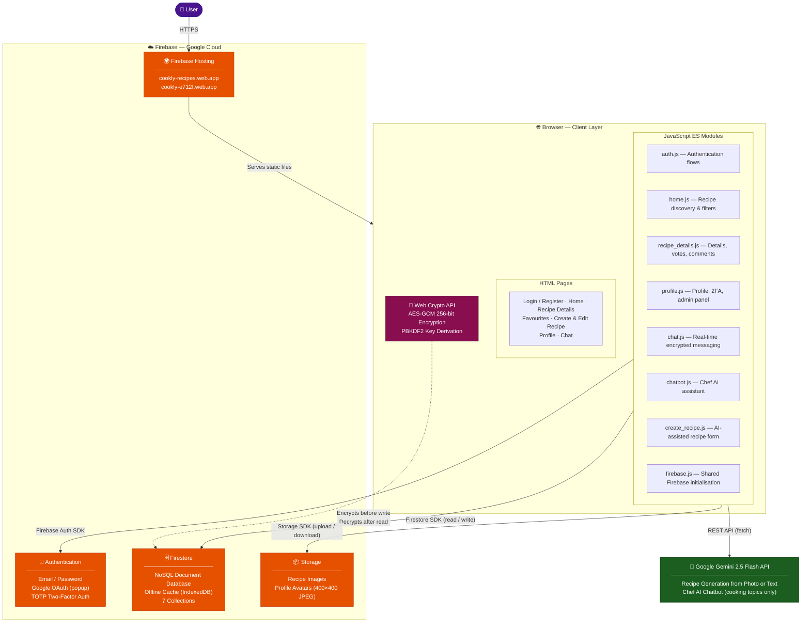
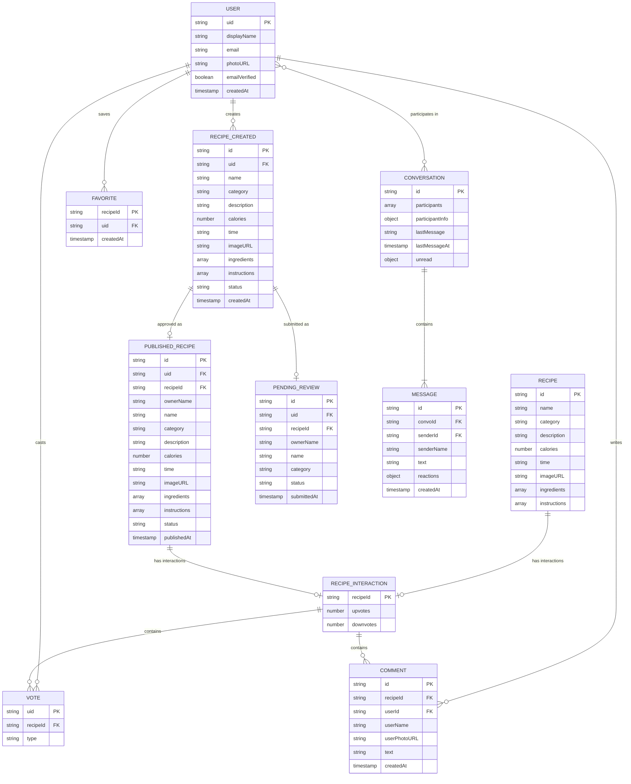

# College of Engineering and Technology
## Web Engineering Department
### Arab Academy for Science, Technology & Maritime Transport (AASTMT)

---

# PROJECT DOCUMENTATION
## Web Engineering

**Project Title: Cookly — Community Cooking Recipes Web Application**

| | |
|---|---|
| **Supervised By** | [ Dr. / Prof. Name ] |
| **Course** | Web Engineering (ECE5604) |
| **Semester** | Term 8 |
| **Academic Year** | 2025 – 2026 |

---

# Table of Contents

1. [Project Team](#1-project-team)
2. [Introduction & Problem Statement](#2-introduction--problem-statement)
3. [Project Objectives](#3-project-objectives)
4. [Technology Stack](#4-technology-stack)
5. [System Architecture & Design](#5-system-architecture--design)
6. [Project Steps & Phases](#6-project-steps--phases)
7. [Group Task Distribution](#7-group-task-distribution)
8. [Development Timeline](#8-development-timeline)
9. [Full Project Documentation](#9-full-project-documentation)
10. [Submission Checklist](#10-submission-checklist)

---

# 1. Project Team

## 1.1 Team Members

| **Full Name** | **College ID** | **Role / Responsibility** | **Email** |
|---|---|---|---|
| [ Name 1 ] | [ ID ] | Auth & Infrastructure — Login/Register pages (HTML+JS+CSS), Chat page (HTML+JS+CSS), Firebase backend & deployment | total_carnage24@yahoo.com |
| [ Name 2 ] | [ ID ] | Discovery & AI — Home page (HTML+JS+CSS), Create Recipe page (HTML+JS+CSS), Chef AI Chatbot (JS+CSS) | [ Email ] |
| [ Name 3 ] | [ ID ] | Recipe Features — Recipe Details (HTML+JS+CSS), Profile page (HTML+JS+CSS), Favourites & Edit Recipe (HTML+JS+CSS) | [ Email ] |

## 1.2 Sub-Group Distribution

| **Sub-Group** | **Member** | **Pages / Files Owned** | **Key Deliverable** |
|---|---|---|---|
| Auth & Chat | [ Name 1 ] | `Login.html` · `Register.html` · `auth.js` · `auth.css` · `chat.html` · `chat.js` · `chat.css` | Complete auth flows, encrypted real-time messaging |
| Infrastructure | [ Name 1 ] | `firebase.js` · `navbar.js` · Firestore rules · `firebase.json` · OAuth config | Secure data layer, live deployment on Firebase Hosting |
| Discovery & AI | [ Name 2 ] | `Cookly.html` · `home.js` · `main.css` (5 sub-files) · `create_recipe.html` · `create_recipe.js` · `recipe-form.css` | Recipe browsing, search/filter, AI recipe generation |
| Chef AI Chatbot | [ Name 2 ] | `chatbot.js` · `chatbot.css` | In-app AI cooking assistant (Gemini 2.5 Flash) |
| Recipe Features | [ Name 3 ] | `recipe_details.html` · `recipe_details.js` · `recipe-details.css` · `favourites.html` · `favourites.js` · `edit_recipe.html` · `edit_recipe.js` · `cards.css` | Full recipe viewing, voting, comments, favourites, editing |
| Profile | [ Name 3 ] | `profile.html` · `profile.js` · `profile.css` | Avatar upload, inline edits, 2FA setup, admin panel |

---

# 2. Introduction & Problem Statement

## 2.1 Background

The food and recipe discovery space is one of the most active consumer web categories. Existing platforms like AllRecipes, Tasty, and YouTube dominate as one-way content delivery systems — users consume recipes but have limited ability to contribute, interact, or build a community around food. Meanwhile, social cooking communities are fragmented across general-purpose social networks that were not built for recipe management.

Firebase (Google) provides a Backend-as-a-Service (BaaS) platform that enables web developers to build full-featured applications without managing a traditional server, making it an ideal technology choice for a student project that requires real authentication, a database, file storage, and hosting. The Gemini API (Google AI) enables generative AI features — recipe generation from photos or text — that were previously only accessible to large teams.

This project, Cookly, combines these technologies to build a community-driven cooking recipe platform where users can discover recipes, contribute their own, interact through voting and comments, and communicate directly with recipe authors.

## 2.2 Problem Statement

- **Lack of community contribution** — existing recipe platforms are largely one-directional; users cannot publish their own recipes for community review and discovery.
- **No built-in author communication** — users who want to ask questions about a recipe have no direct channel to the author within the platform.
- **Recipe creation is tedious** — manually entering all recipe fields is time-consuming; there is no AI-assisted generation from a photo or a text description.
- **Privacy concerns in chat** — most web messaging stores messages as plain text in the database, visible to database administrators.
- **No content moderation workflow** — user-submitted recipes on open platforms are often published without any review, leading to low-quality content.

## 2.3 Motivation

Cookly was built to demonstrate that a team of three students can deliver a production-grade web application — with authentication, AI integration, real-time features, encrypted messaging, and cloud deployment — using modern BaaS and generative AI tools available at no cost. The platform directly addresses the gap between passive recipe browsing and active community participation, giving users the ability to both consume and contribute content through a structured admin approval workflow.

---

# 3. Project Objectives

By the end of this project, the team achieved the following goals:

- **Build a fully responsive multi-page web application** deployable on a permanent public URL with Firebase Hosting.
- **Implement a complete authentication system** including email/password login, Google OAuth sign-in, email verification, password reset, and TOTP-based two-factor authentication (2FA).
- **Create a recipe discovery experience** with search, multi-field filtering (category, time, calories), sorting, pagination, and a community/personal recipe source system.
- **Enable AI-assisted recipe creation** using the Google Gemini 2.5 Flash API — generating full recipe data from either a food photo or a text description.
- **Build an admin content moderation workflow** where user-submitted recipes go through a pending review queue before being published to the community feed.
- **Implement user-to-user encrypted messaging** using the browser's native Web Crypto API (AES-GCM, PBKDF2) so messages stored in Firestore are unreadable without the application code.
- **Deploy and configure the application** on Firebase Hosting with correct OAuth domain whitelisting across two domains (`cookly-recipes.web.app` and `cookly-e712f.web.app`).

---

# 4. Technology Stack

| **Layer** | **Technology / Tool** | **Purpose / Notes** |
|---|---|---|
| Frontend | Vanilla HTML5, CSS3, JavaScript (ES Modules) | Multi-page application, no build step required |
| CSS Framework | Bootstrap 5.3.3 (CDN) | Layout, forms, responsive utilities — partial migration in progress |
| Custom Styling | Modular CSS (8 files) | Brand colors, cards, chat UI, profile, recipe forms |
| Backend | Firebase (BaaS — no traditional server) | Authentication, Firestore, Storage, Hosting |
| Database | Firebase Firestore (NoSQL, document-based) | Real-time database with offline persistent cache (IndexedDB) |
| File Storage | Firebase Storage | Profile pictures, recipe images |
| Authentication | Firebase Authentication | Email/password, Google OAuth, TOTP 2FA (multi-factor) |
| AI — Recipe Generation | Google Gemini 2.5 Flash API | Generates recipe JSON from a food photo or text description |
| AI — Chatbot | Google Gemini 2.5 Flash API | "Chef AI" in-app assistant restricted to cooking topics |
| Encryption | Web Crypto API (browser-native) | AES-GCM 256-bit E2EE for chat messages, PBKDF2 key derivation |
| Image Cropping | Cropper.js (CDN) | Square crop for profile avatars before upload |
| Version Control | Git + GitHub | Source code management, branch: `Hecko` → `main` |
| Deployment | Firebase Hosting | Two live domains: cookly-recipes.web.app, cookly-e712f.web.app |
| Testing | Manual browser testing (Chrome, Opera GX, Mobile Safari) | Cross-browser and mobile responsiveness validation |

---

# 5. System Architecture & Design

## 5.1 High-Level Architecture

Cookly is a **serverless multi-page application** (MPA). There is no backend server. All business logic runs in the browser; Firebase provides authentication, database, and file storage as cloud services.

> **To render this diagram:** paste the code block below into [mermaid.live](https://mermaid.live) and export as PNG or SVG for use in the report or slides.

## 5.2 Frontend Architecture

**Pages (11 HTML files):**

| Page | File | Purpose |
|---|---|---|
| Home | `Cookly.html` | Recipe discovery, search, filter, vote |
| Login | `pages/Login.html` | Email, Google, MFA, forgot password |
| Register | `pages/Register.html` | Account creation |
| Recipe Details | `pages/recipe_details.html` | Full recipe, votes, comments, message author |
| Favourites | `pages/favourites.html` | User's saved recipes |
| Create Recipe | `pages/create_recipe.html` | Form + AI generation |
| Edit Recipe | `pages/edit_recipe.html` | Edit existing recipe |
| Profile | `pages/profile.html` | Avatar, inline edits, 2FA, recipes, admin panel |
| Chat | `pages/chat.html` | User-to-user encrypted messaging |

**State management:** Module-level JavaScript variables within each page's script (no framework). Each page is self-contained.

**Routing:** URL query parameters carry context between pages (e.g., `recipe_details.html?id=abc&source=community`, `chat.html?uid=xyz&name=Heckly`).

**Code sharing:** `scripts/firebase.js` is the single shared module imported by every other script. `scripts/navbar.js` and `scripts/auth.js` are shared across inner pages.

## 5.3 Backend Architecture

Cookly uses **Firebase as a Backend-as-a-Service** — there is no Express, Django, or Node.js server. Business logic runs entirely in the browser.

**Data access pattern:**
- All Firestore reads/writes use the Firebase JS SDK v10.8.0 via ES module imports from Google's CDN
- Security rules (defined in the Firebase Console) enforce authorization server-side — the client cannot bypass them
- Firestore transactions (`runTransaction`) are used for vote counts to prevent race conditions

**Security Rules summary:**

| Collection | Read | Write |
|---|---|---|
| `recipes` | Public | Denied (admin-managed) |
| `published_recipes` | Public | Admin only |
| `users/{uid}/*` | Owner only | Owner only |
| `pending_reviews` | Authenticated | Authenticated |
| `recipe_interactions` | Public (votes+counts), Public (comments) | Verified email only |
| `conversations` | Participants only | Participants only |

## 5.4 Database Schema (Firestore ERD)

> **To render this diagram:** paste the code block below into [mermaid.live](https://mermaid.live) and export as PNG or SVG.
> Note: Firestore is a NoSQL document database — relationships shown here represent logical references (foreign keys by convention), not enforced constraints.

---

# 6. Project Steps & Phases

| **Phase** | **Step / Task** | **Expected Output / Deliverable** |
|---|---|---|
| Phase 1 | Requirements gathering, domain research, wireframing | Project scope, page list, Firestore schema draft |
| Phase 2 | Firebase project setup, Firestore rules, Auth configuration | Initialized Firebase project, working auth on localhost |
| Phase 3 | Core pages — Home, Recipe Details, Login, Register | Functional multi-page app with recipe browsing |
| Phase 4 | User features — Favourites, Create/Edit Recipe, Profile | Full CRUD for user recipes, avatar upload, inline edits |
| Phase 5 | AI integration — Gemini recipe generation + Chef AI chatbot | AI-assisted recipe creation, chatbot on home page |
| Phase 6 | Advanced auth — Google OAuth, TOTP 2FA, password reset | Complete authentication system |
| Phase 7 | Community features — voting, comments, admin approval workflow | Engagement system and moderation queue |
| Phase 8 | User-to-user messaging — Firestore chat + AES-GCM encryption | Encrypted real-time chat with reactions |
| Phase 9 | Mobile responsiveness, CSS polish, Bootstrap migration (Login/Register) | Responsive design across all breakpoints |
| Phase 10 | Deployment — Firebase Hosting, OAuth domain whitelisting | Live at cookly-recipes.web.app |

---

# 7. Group Task Distribution

| **Page / Feature** | **Files (HTML · JS · CSS)** | **Member** | **Status** |
|---|---|---|---|
| **[ Name 1 ] — Auth & Infrastructure** | | | |
| Login page | `Login.html` · `auth.js` · `auth.css` | [ Name 1 ] | ✅ Complete |
| Register page | `Register.html` · `auth.js` · `auth.css` | [ Name 1 ] | ✅ Complete |
| Chat / Messaging page | `chat.html` · `chat.js` · `chat.css` | [ Name 1 ] | ✅ Complete |
| Firebase config & Firestore schema | `firebase.js` · Firestore rules | [ Name 1 ] | ✅ Complete |
| Firebase Hosting & OAuth setup | `firebase.json` · OAuth credentials | [ Name 1 ] | ✅ Complete |
| Shared nav (all inner pages) | `navbar.js` | [ Name 1 ] | ✅ Complete |
| **[ Name 2 ] — Discovery & AI** | | | |
| Home / Discovery page | `Cookly.html` · `home.js` · `main.css` + sub-files | [ Name 2 ] | ✅ Complete |
| Create Recipe page + AI generation | `create_recipe.html` · `create_recipe.js` · `recipe-form.css` | [ Name 2 ] | ✅ Complete |
| Chef AI Chatbot | `chatbot.js` · `chatbot.css` | [ Name 2 ] | ✅ Complete |
| Buttons & shared UI components | `buttons.css` | [ Name 2 ] | ✅ Complete |
| **[ Name 3 ] — Recipe Features** | | | |
| Recipe Details page | `recipe_details.html` · `recipe_details.js` · `recipe-details.css` | [ Name 3 ] | ✅ Complete |
| Profile page | `profile.html` · `profile.js` · `profile.css` | [ Name 3 ] | ✅ Complete |
| Favourites page | `favourites.html` · `favourites.js` · `cards.css` | [ Name 3 ] | ✅ Complete |
| Edit Recipe page | `edit_recipe.html` · `edit_recipe.js` · `recipe-form.css` | [ Name 3 ] | ✅ Complete |

---

# 8. Development Timeline

| **Week** | **Phase / Task** | **Member** | **Files Involved** |
|---|---|---|---|
| 1 | Project planning, schema design, Firebase setup & rules | [ Name 1 ] | `firebase.js` · Firestore rules · `firebase.json` |
| 2 | Login & Register pages — forms, validation, auth flows, styling | [ Name 1 ] | `Login.html` · `Register.html` · `auth.js` · `auth.css` |
| 2 | Home page structure, recipe grid, CSS design system | [ Name 2 ] | `Cookly.html` · `home.js` · `main.css` |
| 3 | Recipe Details page — render, metadata, hero image | [ Name 3 ] | `recipe_details.html` · `recipe_details.js` · `recipe-details.css` |
| 3 | Home page filters, search, sorting, pagination | [ Name 2 ] | `home.js` · `main.content.css` |
| 4 | Favourites page + Edit Recipe page | [ Name 3 ] | `favourites.html/js` · `edit_recipe.html/js` · `cards.css` |
| 4 | Create Recipe page + Gemini AI generation (photo & text) | [ Name 2 ] | `create_recipe.html` · `create_recipe.js` · `recipe-form.css` |
| 5 | Profile page — avatar crop, inline edits, 2FA UI, admin panel | [ Name 3 ] | `profile.html` · `profile.js` · `profile.css` |
| 5 | Chef AI chatbot — Gemini integration, conversation history | [ Name 2 ] | `chatbot.js` · `chatbot.css` |
| 6 | Advanced auth — Google OAuth, TOTP 2FA, password reset | [ Name 1 ] | `auth.js` · Firebase Auth MFA config |
| 6 | Voting system (Firestore transactions) + comments system | [ Name 3 ] | `recipe_details.js` · Firestore `recipe_interactions` |
| 7 | Chat page — real-time messaging + AES-GCM encryption | [ Name 1 ] | `chat.html` · `chat.js` · `chat.css` |
| 7 | Admin approval workflow (pending → publish → reject) | [ Name 1 ] | `profile.js` · Firestore rules |
| 8 | Mobile responsiveness polish across all pages | All | `main.responsive.css` · all page CSS |
| 9 | Firebase Hosting deployment + OAuth domain whitelisting | [ Name 1 ] | `firebase.json` · Google Cloud Console |
| 10 | Cross-browser testing, final bug fixes, documentation | All | All files · `PROJECT_DOCUMENTATION.md` |

---

# 9. Full Project Documentation

## 9.1 Features & Functional Requirements

**Recipe Discovery:**
- Browse built-in and community-published recipes on the home page
- Live search by name, description, or category with 220ms debounce
- Filter by category (dropdown), maximum time (minutes), maximum calories
- Sort by most liked / least liked / default
- Paginated display (12 per page) with a "Load More" button
- Lazy-loaded vote counts per visible page to minimize Firestore reads

**Authentication:**
- Email/password registration with display name and password confirmation
- Email/password login with "Invalid credentials" error handling
- Google OAuth sign-in via popup (works on all configured domains)
- Forgot password — sends reset link via Firebase to registered email
- TOTP-based Two-Factor Authentication (2FA) — QR code setup, verify code, enable/disable
- Verification email sent automatically on registration with an on-screen confirmation message
- Profile 2FA button shows "Verify Email" (sends verification link) when email is not yet verified, switches to "Enable 2FA" once verified

**Recipe Management:**
- Create recipe form with name, category, description, calories, time, image upload, ingredients, and instructions
- AI Recipe Generation (Gemini 2.5 Flash) — generate a full recipe from a food photo (base64) or a text description
- Edit recipe — pre-filled form, preserves existing image if no new file selected
- Recipe status system: `private` → `pending` → `published`
- Submit for admin review — moves recipe to pending queue
- Admin approval/rejection — approve publishes to community, reject reverts to private

**User Profile:**
- Avatar upload with Cropper.js square crop (exports 400×400 JPEG to Firebase Storage)
- Inline name editing (Firebase `updateProfile`)
- Inline email update with verification to new address (`verifyBeforeUpdateEmail`)
- Password reset via email link
- 2FA management (enable with QR scan, disable)
- Recipe preview grid with status badges (Private / Pending / Published)
- Favourite count and recipe count stats

**Voting & Comments:**
- Upvote / downvote on community and built-in recipes
- Not logged in → clicking any vote or comment button redirects to Login with a `?redirect=` param, returning the user to the same recipe after sign-in
- Logged in but email not verified → vote and comment buttons are disabled with an inline message (recipe detail page) or a toast notification (home page cards)
- Toggle behavior — clicking the same vote button again removes the vote
- Atomic vote transaction (Firestore `runTransaction`) prevents race conditions
- Comments on recipe detail pages — comment form always visible; Post Comment redirects to login if not logged in
- Comment deletion by comment author or admin

**Favourites:**
- Add/remove favourites from home page cards (heart icon)
- Dedicated favourites page with recipe resolution across all three collections
- Unfavourite removes the card from the DOM without a re-fetch

**User-to-User Messaging:**
- Direct messages between any two users
- Real-time updates via Firestore `onSnapshot`
- AES-GCM 256-bit encryption — messages stored as base64 ciphertext in Firestore
- Key derived via PBKDF2 (100,000 iterations) from conversation ID + server pepper
- Message reactions (6 emoji options) using `arrayUnion` / `arrayRemove`
- Unread badge on the Messages nav link (live counter)
- Mobile-optimized layout with slide transitions and back button
- "Message Author" button on community recipe detail pages

**Chef AI Chatbot:**
- Floating chat bubble (👨‍🍳) on the home page
- Powered by Gemini 2.5 Flash API
- Maintains full conversation history for context-aware responses
- Restricted to cooking, recipes, ingredients, meal planning, and nutrition topics
- Markdown bold formatting rendered in reply bubbles

## 9.2 Non-Functional Requirements

- **Security** — All Firestore operations are gated by server-side security rules. Chat messages are AES-GCM encrypted before leaving the browser. Firebase Auth tokens are verified server-side. The Gemini API key is stored in `scripts/config.js` which is listed in `.gitignore` — it is never committed to the repository but is included in Firebase deployments via the CLI.
- **Responsiveness** — Mobile-first design, tested on 320px–1440px. Chat page uses a slide-transition layout for mobile. All pages render correctly on iOS Safari, Chrome, and Opera GX.
- **Performance** — Vote counts are lazy-loaded per visible page (not upfront for all recipes). Firestore's `persistentLocalCache` (IndexedDB) caches query results locally for instant repeat visits.
- **Scalability** — Stateless frontend; all scaling handled by Firebase's infrastructure. Firestore is horizontally scalable by design.
- **Availability** — Hosted on Firebase Hosting's global CDN. 99.95% uptime SLA from Google.
- **Privacy** — Chat messages are encrypted at rest (AES-GCM). Firebase encrypts all data at rest (AES-256) and in transit (TLS) by default.

## 9.3 API Documentation

Cookly does not use a traditional REST API. All data operations are performed directly via the Firebase JS SDK. The following table documents the key Firestore and Firebase Auth operations used as the application's data layer.

| **Operation** | **SDK Method** | **Description** | **Auth Required** | **Collection** |
|---|---|---|---|---|
| Load recipes | `getDocs(collection(...))` | Fetch all recipes from a source | No | `recipes` / `published_recipes` |
| Load recipe by ID | `getDoc(doc(...))` | Fetch a single recipe | No (community) / Yes (mine) | Varies |
| Create recipe | `addDoc(collection(...))` | Save a new user recipe | Yes | `users/{uid}/recipes_created` |
| Update recipe | `updateDoc(doc(...))` | Edit an existing recipe | Yes (owner) | `users/{uid}/recipes_created` |
| Vote on recipe | `runTransaction(...)` | Atomic upvote/downvote | Yes + verified email | `recipe_interactions` |
| Post comment | `addDoc(collection(...))` | Add a comment to a recipe | Yes + verified email | `recipe_interactions/{id}/comments` |
| Delete comment | `deleteDoc(doc(...))` | Remove a comment | Yes (owner or admin) | `recipe_interactions/{id}/comments` |
| Toggle favourite | `setDoc` / `deleteDoc` | Add or remove favourite | Yes | `users/{uid}/favorites` |
| Submit for review | `addDoc` + `updateDoc` | Submit recipe to pending queue | Yes | `pending_reviews` |
| Approve recipe | `addDoc` + `updateDoc` + `deleteDoc` | Publish and remove from queue | Admin only | `published_recipes` |
| Send message | `addDoc` + `updateDoc` | Encrypt and send chat message | Yes | `conversations/{id}/messages` |
| Load conversations | `onSnapshot(query(...))` | Real-time conversation list | Yes | `conversations` |
| Login (email) | `signInWithEmailAndPassword` | Email/password auth | — | Firebase Auth |
| Login (Google) | `signInWithPopup` | Google OAuth popup | — | Firebase Auth |
| Register | `createUserWithEmailAndPassword` + `updateProfile` | Create account | — | Firebase Auth |
| Enable 2FA | `TotpMultiFactorGenerator.generateSecret` + `enroll` | TOTP enrollment | Yes | Firebase Auth MFA |
| Upload image | `uploadBytes` + `getDownloadURL` | Upload to Firebase Storage | Yes | Firebase Storage |
| Generate recipe (AI) | `fetch(GEMINI_URL, ...)` | Gemini API call with image or text | — | External API |

## 9.4 UI/UX Design Notes

**Color Palette:**
- Primary (dark blue): `#022175`
- Accent (coral/orange): `#e4614a`
- Background (warm cream): `#f5eede`
- White: `#ffffff`
- Muted text: `#6b7280`
- Border: `#e5e7eb`

**Typography:**
- Headings / Logo: **Fredoka** (Google Fonts) — 500, 600, 700 weights
- Body / UI: **Roboto** (Google Fonts) — 400, 500, 700 weights
- Base font size: 16px, line height 1.5–1.6

**Key User Flows:**
1. **Guest → Recipe discovery:** Land on home page → browse cards → click View → read recipe details
2. **Register → Create recipe with AI:** Register → Profile → Create Recipe → upload photo → Gemini fills form → submit → pending review
3. **Login → Vote & Comment:** Login → browse home → click 👍 on card → View recipe → leave comment
4. **Message author:** View community recipe → click "💬 Message [Author]" → chat opens with conversation auto-created
5. **Admin review:** Login as admin → Profile → admin section shows pending count → expand row → Approve/Reject

**Design System:**
- Rounded cards with 16–24px border radius
- Coral accent buttons (pill-shaped with `border-radius: 999px` on auth pages)
- Recipe cards with hover elevation and lazy-loaded images (`loading="lazy"`)
- Mobile navigation: hamburger menu with slide-down links

## 9.5 Testing Plan

| **Test Type** | **Tool / Method** | **Scope** | **Pass Criteria** |
|---|---|---|---|
| Manual functional testing | Chrome DevTools | All 11 pages, all features | Every feature completes without console errors |
| Cross-browser testing | Chrome, Opera GX | Home page, Auth, Chat | Consistent rendering and behavior |
| Mobile testing | iOS Safari (physical device) | Home, Chat, Recipe Details | Responsive layout, mobile nav, chat slide transitions |
| Auth flow testing | Firebase Console + browser | Register, Login, Google OAuth, 2FA, Reset | All auth paths complete and redirect correctly |
| Firestore rules testing | Firebase Rules Simulator | All collections | Unauthorized writes rejected, authorized writes succeed |
| Encryption testing | Chrome DevTools (Firestore console) | Chat messages | Stored messages appear as base64 ciphertext, not plain text |
| AI generation testing | Manual | Create Recipe — photo and text modes | Gemini returns parseable JSON and fills all form fields |
| Deployment testing | Live URL testing on mobile + desktop | All pages on cookly-recipes.web.app | All pages load, auth works, no CORS or CSP errors |

## 9.6 Deployment & DevOps

- **Hosting platform:** Firebase Hosting (Google) — global CDN, HTTPS by default
- **Live domains:**
  - `https://cookly-recipes.web.app` (primary)
  - `https://cookly-e712f.web.app` (secondary)
- **Deploy command:** `firebase deploy --only hosting:cookly-recipes --project cookly-e712f`
- **No build step required** — raw HTML/CSS/JS files are served directly
- **Firebase configuration files:** `firebase.json` (hosting config), `.firebaserc` (project alias)
- **Version control:** Git with branch `Hecko` as the active development branch; `main` as the stable branch
- **Environment variables:** Firebase public config is in `scripts/firebase.js` (safe to expose — security enforced by Firestore rules). The Gemini API key is in `scripts/config.js` which is `.gitignore`d — paste the key locally before deploying, it will never be committed to the repository.
- **OAuth configuration:** Google Sign-In authorized domains and redirect URIs configured in both Firebase Console (Authentication → Authorized Domains) and Google Cloud Console (OAuth 2.0 credentials) — see `OAUTH_SETUP.md`
- **No CI/CD pipeline** — deployment is manual via Firebase CLI

---

# 10. Submission Checklist

**☑** System architecture diagram completed

**☑** Database schema (Firestore collections) finalized

**☑** All data operations documented (Section 9.3)

**☑** All frontend pages implemented and responsive (11 pages)

**☑** Firebase backend (Auth, Firestore, Storage) fully configured

**☑** Authentication system complete — email, Google, 2FA, password reset

**☑** Community features implemented — voting, comments, admin approval

**☑** User-to-user messaging with AES-GCM encryption complete

**☑** AI features complete — recipe generation (photo + text) and Chef AI chatbot

**☑** Application deployed to production URL (`cookly-recipes.web.app`)

**☑** Firestore security rules configured and tested

**☑** OAuth domains configured for all hosted domains

**☑** Cross-browser and mobile testing completed

**☑** Code reviewed and merged to main branch

**☐** Final project report formatted and submitted

**☐** Presentation slides prepared

**☐** Live demo rehearsed by all team members